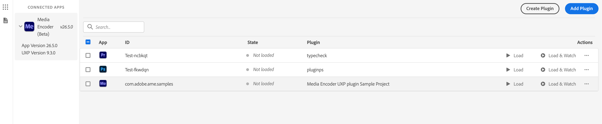
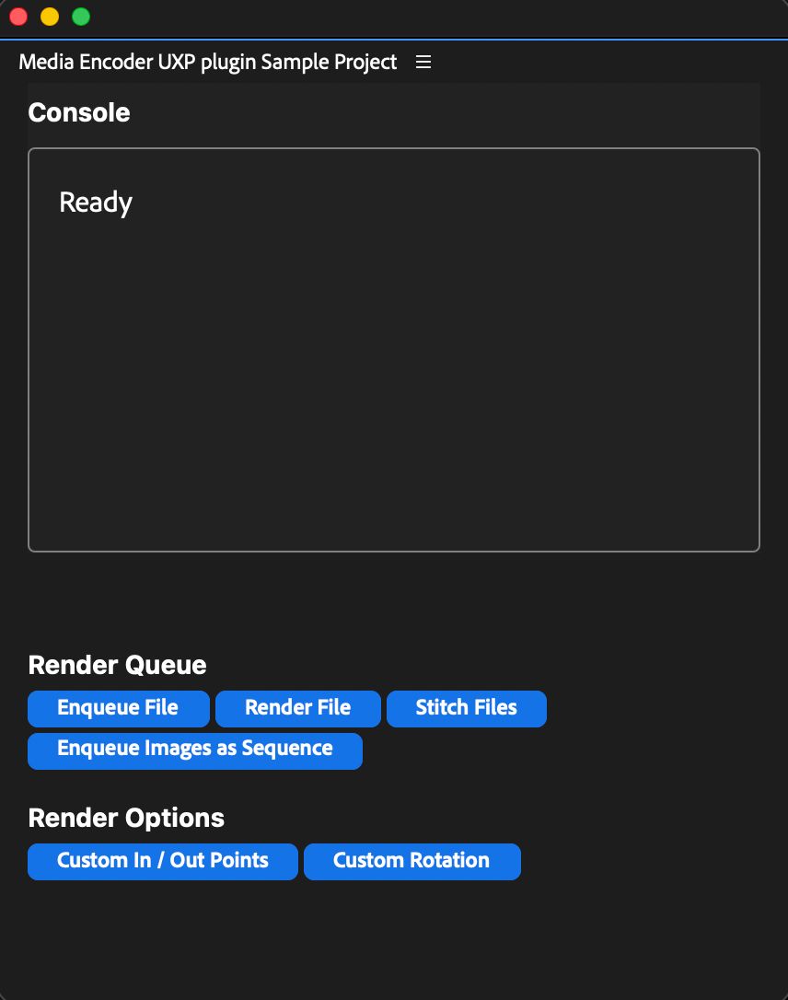

# Media Encoder UXP Samples

A collection of sample plugins for Adobe Media Encoder built with UXP. Use them as a reference, adapt them in your own projects, or explore them to understand the Media Encoder UXP API surface. The full API reference is available at [developer.adobe.com/media-encoder/uxp](https://developer.adobe.com/media-encoder/uxp/).

**New to UXP plugins?** We recommend starting with the official [**Building your first UXP plugin**](https://developer.adobe.com/media-encoder/uxp/plugins/) tutorial. It walks through scaffolding a plugin with the UXP Developer Tool and loading it into Media Encoder. The samples in this repository will be easier to follow afterwards.

---

## Contents

- [Prerequisites](#prerequisites)
- [Samples](#samples)
- [Version compatibility](#version-compatibility)
- [Getting started](#getting-started)
- [TypeScript support](#typescript-support)
- [Linting](#linting)
- [Frequently asked questions](#frequently-asked-questions)
- [Additional resources](#additional-resources)
- [Contributing](#contributing)
- [License](#license)

---

## Prerequisites

| Tool                               |        Version        | Where to get it                                                                                         |
| :--------------------------------- | :-------------------: | :------------------------------------------------------------------------------------------------------ |
| **Media Encoder** (stable or beta) |    `26.5` or newer    | [adobe.com/products/media-encoder](https://www.adobe.com/products/media-encoder.html)                   |
| **UXP Developer Tool** (UDT)       |  `2.2.1.18` or newer  | Install via [Creative Cloud Desktop](https://creativecloud.adobe.com/apps/download/uxp-developer-tools) |
| **Node.js**                        | LTS (`18.x` or newer) | [nodejs.org](https://nodejs.org/)                                                                       |
| **Code editor**                    |           —           | Visual Studio Code, Cursor, or any editor of your choice                                                |

Before loading any plugin from UDT, enable **Developer Mode** in Media Encoder:

> **Edit → Preferences → Plugins → Enable developer mode**, then restart Media Encoder.

---

## Samples

| Sample                                                    | Description                                                                                                                                                                                                                                         | Stack      | Build required |
| :-------------------------------------------------------- | :-------------------------------------------------------------------------------------------------------------------------------------------------------------------------------------------------------------------------------------------------- | :--------- | :------------- |
| [`media-encoder-api`](./sample-panels/media-encoder-api/) | A reference panel that exercises a broad set of Media Encoder UXP APIs: adding media to the queue, updating redner settings, starting, pausing, and stopping renders. The recommended starting point when investigating how a specific API behaves. | TypeScript | Yes            |

### Which sample should I start with?

- **To learn the Media Encoder UXP API** → [`media-encoder-api`](./sample-panels/media-encoder-api/)

---

## Version compatibility

The values below are sourced directly from each sample's `manifest.json` and `package.json`. In the event of a discrepancy, the manifests are authoritative.

| Sample              | Min Media Encoder | Manifest |
| :------------------ | :---------------: | :------: |
| `media-encoder-api` |     `26.5.0`      |   `v5`   |

---

## Getting started

### 1. Clone the repository

```bash
git clone https://github.com/AdobeDocs/uxp-media-encoder-samples.git
cd uxp-media-encoder-samples
```

### 2. Build the sample you want to run

Each sample has its own build (or no-build) requirements.

**[`media-encoder-api`](./sample-panels/media-encoder-api/README.md) — TypeScript, requires a build**
See the [`media-encoder-api` README](./sample-panels/media-encoder-api/README.md) for full build and setup instructions.

### 3. Load the plugin in Media Encoder

The loading flow is the same for every sample:

1. Launch Media Encoder (or Media Encoder Beta).
2. Launch the UXP Developer Tool.
3. Click **Add Plugin** and select the `manifest.json` for the sample.
4. Click **Load**, or **Load & Watch** to enable automatic reloads while editing source files.

<p align="center">
  
</p>

The panel appears in Media Encoder under **Window → UXP Plugins**.

<p align="center">
  
</p>

---

## Frequently asked questions

<details>
<summary><strong>My plugin does not appear in Media Encoder.</strong></summary>

Verify the following:

1. Developer Mode is enabled in Media Encoder, and Media Encoder has been restarted since enabling it.
2. The `host.minVersion` declared in your `manifest.json` is less than or equal to your installed Media Encoder version.
3. UDT can detect Media Encoder in its left-hand pane. If it cannot, restart both applications.

</details>

<details>
<summary><strong>Where do <code>console.log</code> outputs appear?</strong></summary>

In UDT, locate your loaded plugin and click **Debug**. This opens a Chromium DevTools window attached to your plugin, providing access to the console, network activity, and DOM inspector.

</details>

<details>
<summary><strong>Are Media Encoder UXP API calls asynchronous?</strong></summary>

Yes. Most Media Encoder UXP APIs return Promises and must be awaited (or chained with `.then()`). Failing to await them produces incorrect results and can block the panel UI. The `media-encoder-api` sample uses `async`/`await` consistently throughout its `src/` modules and serves as a reference for the recommended pattern.

</details>

<details>
<summary><strong>How do I request file system or network access?</strong></summary>

Declare the required capabilities under `requiredPermissions` in your `manifest.json`:

- The [`media-encoder-api` manifest](./sample-panels/media-encoder-api/html/manifest.json) demonstrates `localFileSystem` and `clipboard` permissions.

</details>

<details>
<summary><strong>UDT is not reloading my changes to <code>manifest.json</code>.</strong></summary>

UDT's **Watch** mode only reloads source files. Changes to `manifest.json` require an explicit **Unload** followed by **Load** in UDT.

</details>

<details>
<summary><strong>Can I combine a UXP panel with a native C++ plugin?</strong></summary>

Yes. See the [Hybrid Plugins](https://developer.adobe.com/media-encoder/uxp/plugins/hybrid-plugins/) guide in the official documentation.

</details>

---

## Additional resources

- [UXP for Media Encoder — Introduction](https://developer.adobe.com/media-encoder/uxp/)
- [Building your first UXP plugin](https://developer.adobe.com/media-encoder/uxp/plugins/)
- [Plugin concepts: panels, commands, manifest](https://developer.adobe.com/media-encoder/uxp/plugins/concepts/)
- [Hybrid plugins](https://developer.adobe.com/media-encoder/uxp/plugins/hybrid-plugins/)
- [Sharing and distributing plugins](https://developer.adobe.com/media-encoder/uxp/plugins/distribute/)

---

## Contributing

Contributions are welcome. Before submitting a pull request, please:

- Review the [contributing guide](./.github/CONTRIBUTING.md).
- Adhere to the [code of conduct](./CODE_OF_CONDUCT.md).
- Complete the [pull request template](./.github/PULL_REQUEST_TEMPLATE.md).

Bug reports and feature requests can be filed via [GitHub Issues](https://github.com/AdobeDocs/uxp-media-encoder-samples/issues).

---

## License

This project is released under the terms of the [LICENSE](./LICENSE). See [COPYRIGHT](./COPYRIGHT) for additional notices.
